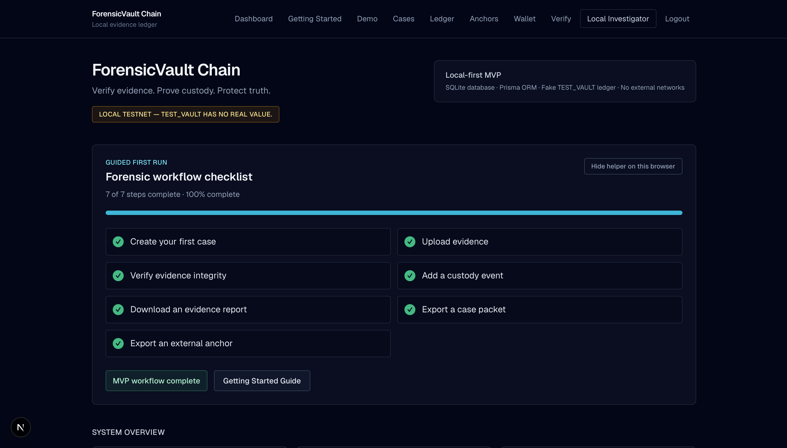
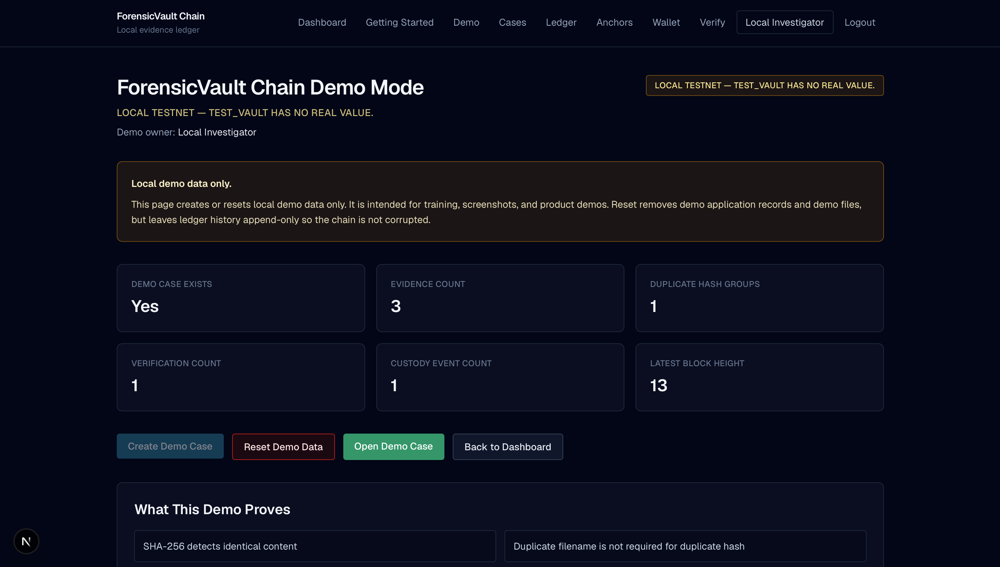
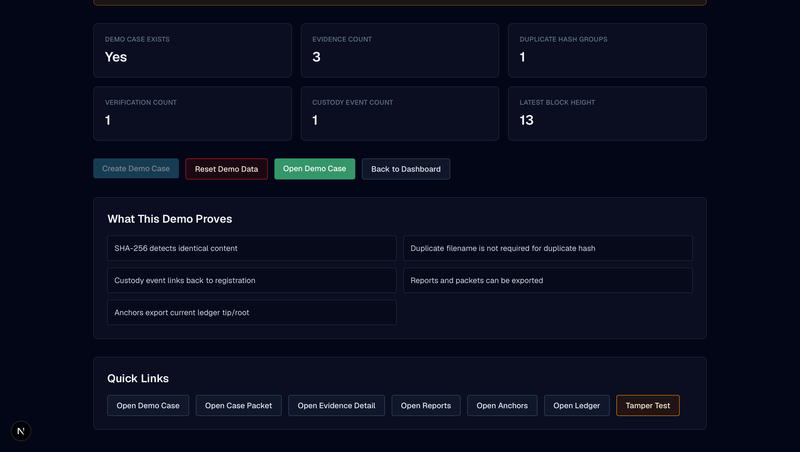
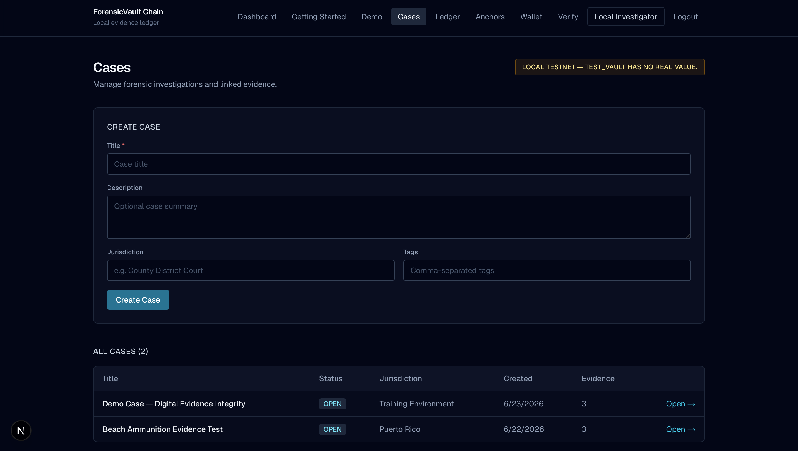
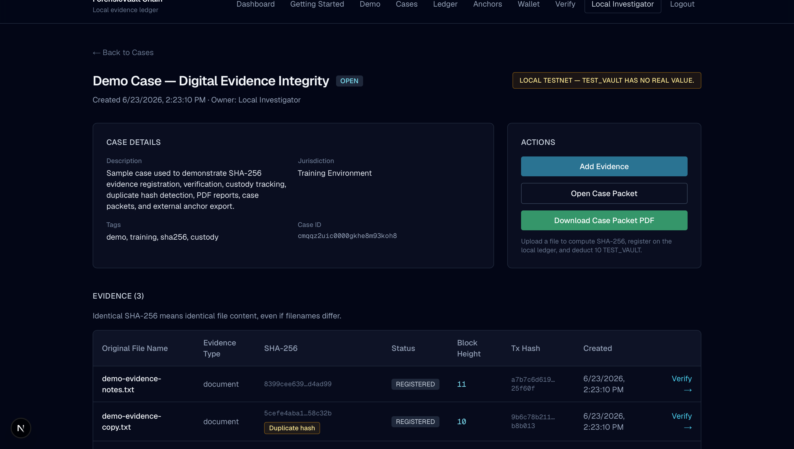
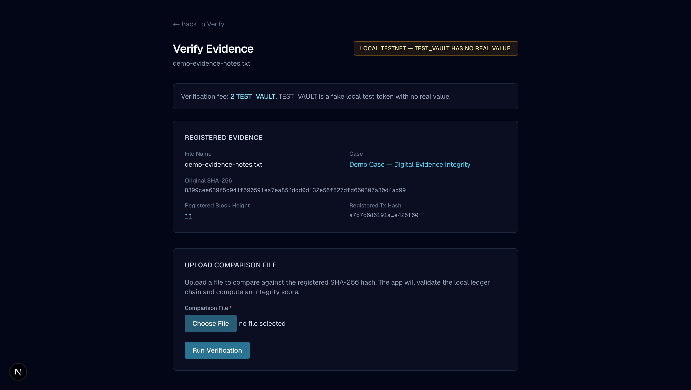
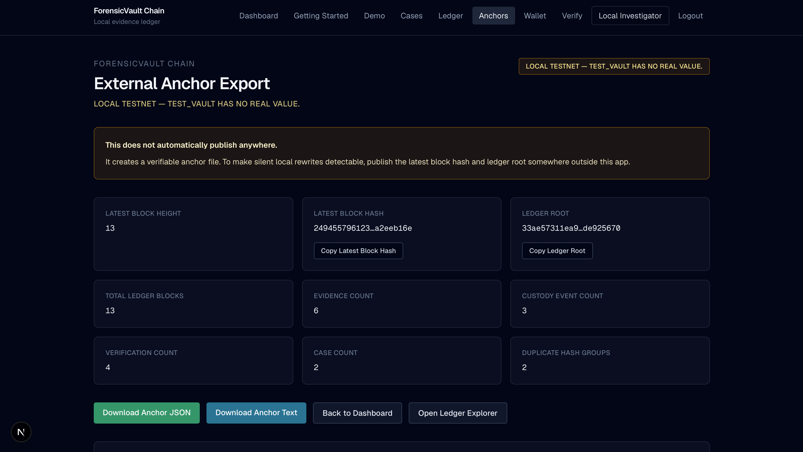
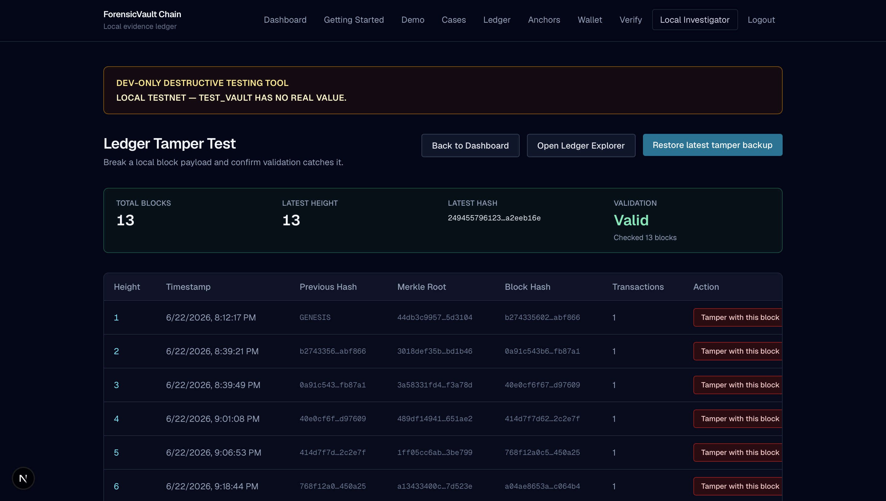
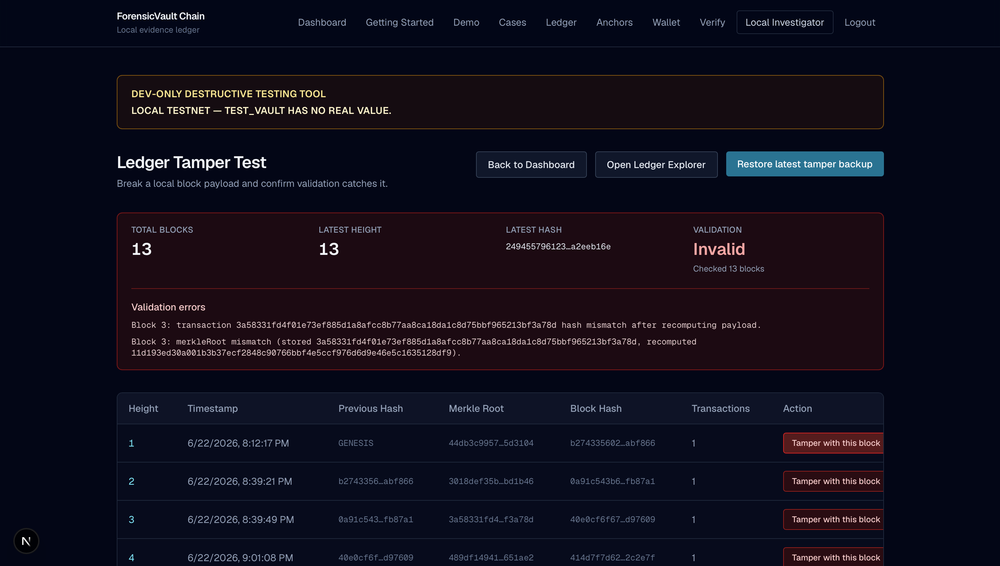
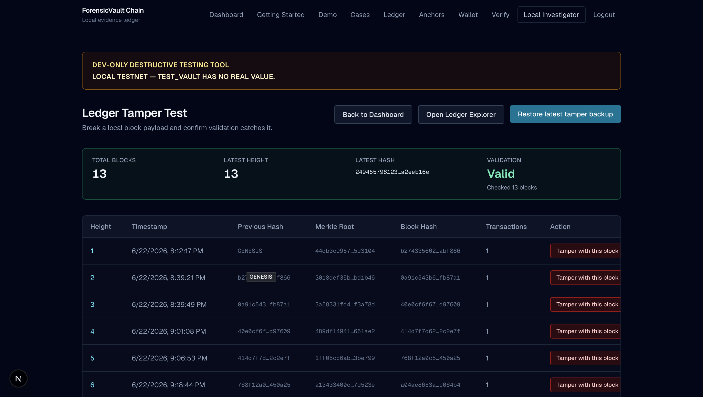

# ForensicVault Chain

Verify evidence. Prove custody. Protect truth.

**LOCAL TESTNET - TEST_VAULT HAS NO REAL VALUE.**

ForensicVault Chain is a local-first forensic evidence integrity MVP. It registers digital evidence with SHA-256 hashes, records custody events, verifies files later, maintains a hash-linked local ledger, generates reports/case packets, supports tamper testing, and exports external anchor files.

## Important Limitation

This app is tamper-evident, not tamper-proof. If someone controls the local database or disk, they may rewrite local data. External anchor exports are used to make silent rewrites detectable later.

This project does not claim to provide a real blockchain, real cryptocurrency, legal admissibility guarantees, or production-grade security.

## Features

- Local investigator login
- Demo mode
- First-run helper
- Case creation
- Evidence upload
- SHA-256 hashing
- Duplicate hash warning
- Evidence verification
- Chain-of-custody events
- Local hash-linked ledger
- Tamper test page
- Individual PDF evidence reports
- Case packet PDF export
- External anchor JSON/text export
- Fake TEST_VAULT local fee history

## Screenshots



Dashboard overview showing the local evidence integrity workspace.



Demo mode entry point for creating a guided sample case.



Demo workflow details with seeded evidence and custody context.



Cases list for reviewing and opening investigation records.



Case detail view with evidence, custody events, and export actions.



Evidence verification page for comparing uploaded files against registered hashes.



External anchor export view for preserving ledger proof outside the local app.



Tamper test result showing evidence that still matches its registered hash.



Tamper test result showing a detected hash mismatch after file changes.



Tamper test result after restoring evidence to its original valid state.

## Tech Stack

- Next.js App Router
- TypeScript
- Tailwind CSS
- Prisma 7
- SQLite
- `@prisma/adapter-better-sqlite3`
- `pdf-lib`
- Node crypto

## Local Setup

Install dependencies:

```bash
npm install
```

Create `.env`:

```bash
DATABASE_URL="file:./dev.db"
LOCAL_DEV_SEED_EMAIL="local@forensicvault.dev"
LOCAL_DEV_SEED_PASSWORD="change-me-local-only"
```

Run database migrations:

```bash
npx prisma migrate dev
```

Start the local dev server:

```bash
npm run dev
```

Open:

```text
http://localhost:3000
```

Seed local development data:

```text
http://localhost:3000/api/dev/seed
```

## Default Local Dev Login

The seed route creates a local development account only. The email defaults to
`local@forensicvault.dev`, or the value of `LOCAL_DEV_SEED_EMAIL` in `.env`.

Set the local-only password with `LOCAL_DEV_SEED_PASSWORD` in `.env` before
running the seed route. Do not reuse this password outside local development.

## Demo Workflow

1. Log in.
2. Open Demo.
3. Create Demo Case.
4. Open Demo Case.
5. View duplicate SHA-256 warning.
6. Verify evidence.
7. View custody event.
8. Download case packet.
9. Export anchor.
10. Run tamper test.

## ForensicVault Shield

ForensicVault Shield is available at:

```text
http://localhost:3000/guard
```

Shield is a rule-based integrity monitoring dashboard for local evidence,
custody, verification, duplicate hash patterns, ledger health, and anchor
readiness. Phase 1 is AI-ready, but it does not call AI APIs, external APIs, or
automated decision systems.

Shield does not replace deterministic SHA-256 verification, ledger validation,
custody hash linkage, signature checks, or external anchor comparison. The app
remains local-first and tamper-evident, not tamper-proof.

Shield Phase 1.1 adds alert acknowledgements and a Shield event log.
Acknowledgements document that an investigator reviewed a deterministic alert,
but they do not delete the alert, change the underlying evidence, modify the
ledger, or prove the issue is resolved.

## Project Status

Local MVP / testnet simulation.

ForensicVault Chain is intended for local development, demos, training, and exploration of forensic integrity workflows. It does not publish to a real blockchain or timestamp authority automatically.

## Roadmap

- Better production auth
- Streaming file uploads
- Stronger custody signatures
- RFC 3161 timestamping
- GitHub/Gist anchoring
- Audit log export
- Role-based permissions
- Evidence search/filtering
- Deployment hardening
## License

Copyright (c) 2026 Luis Correa / rep3protocol. All rights reserved.

This project is public for viewing and portfolio purposes, but it is not open source. No permission is granted to copy, modify, distribute, sublicense, sell, host, deploy, or use this software without prior written permission.
